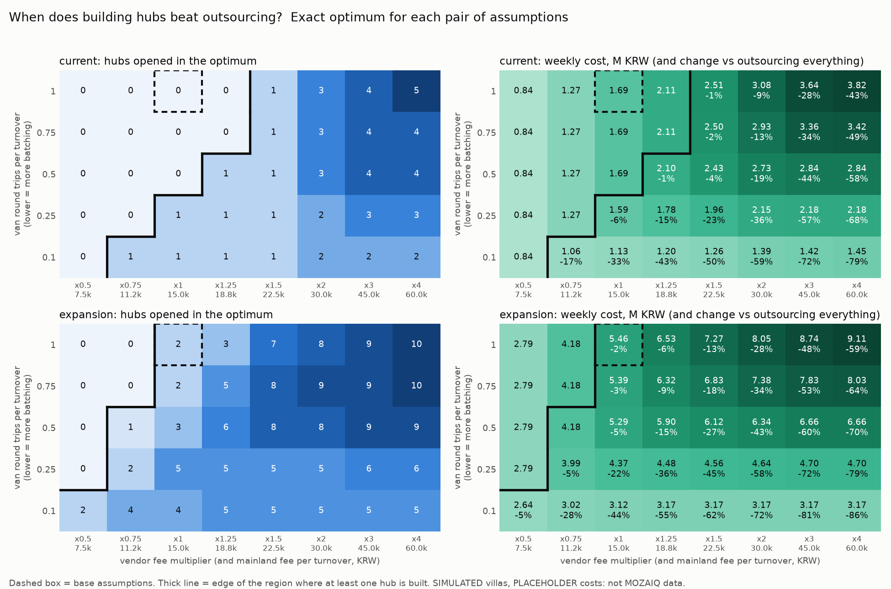
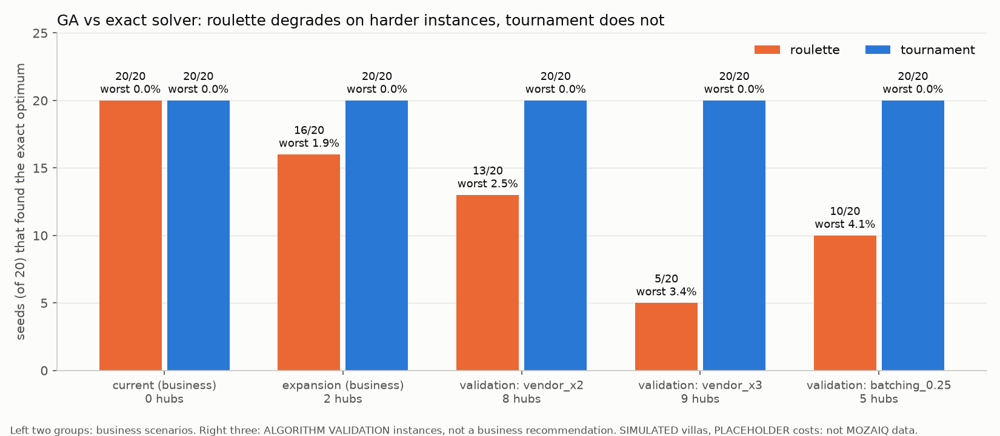
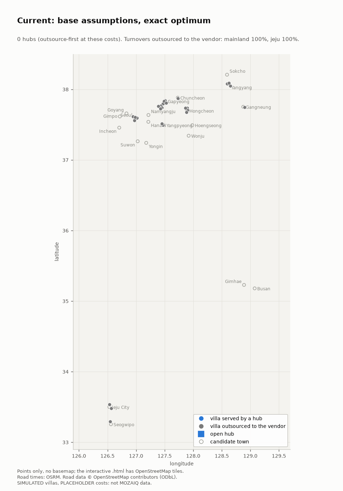
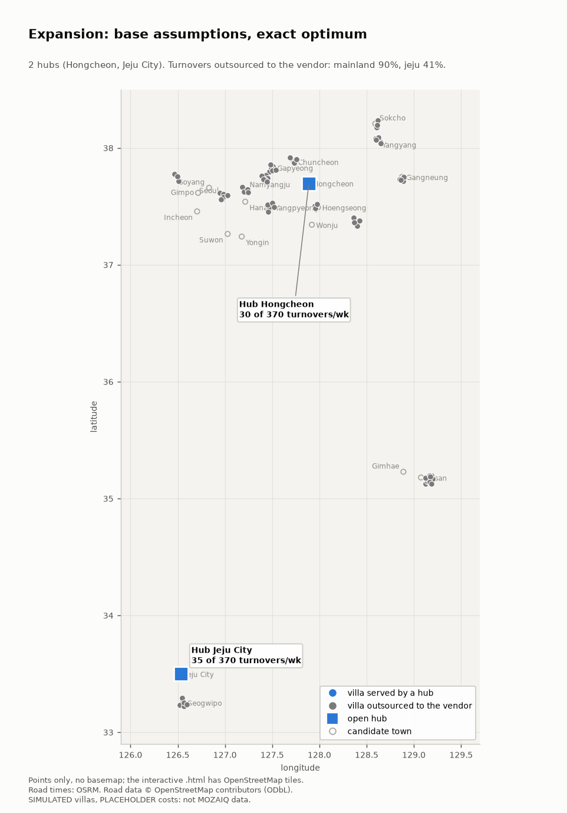
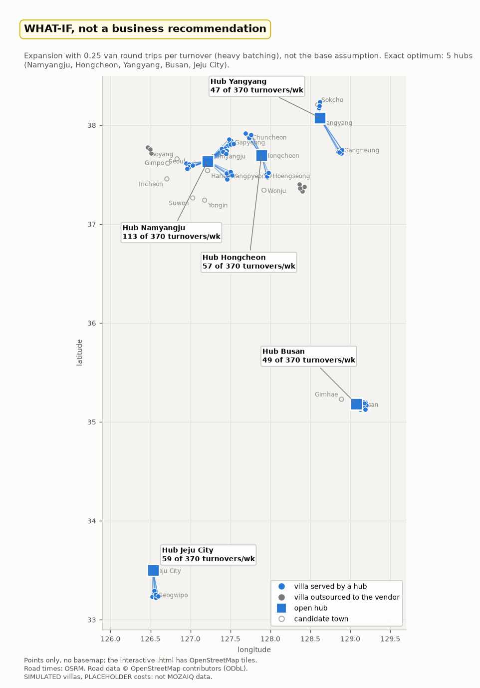
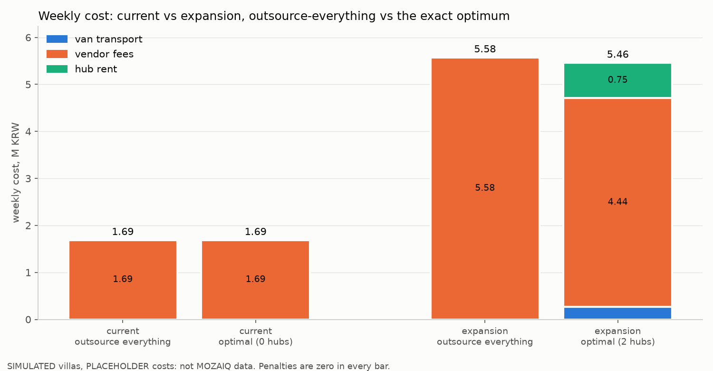
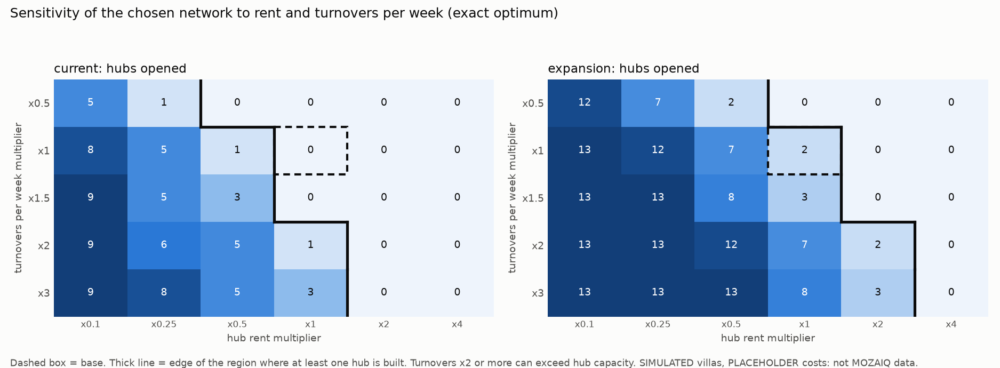
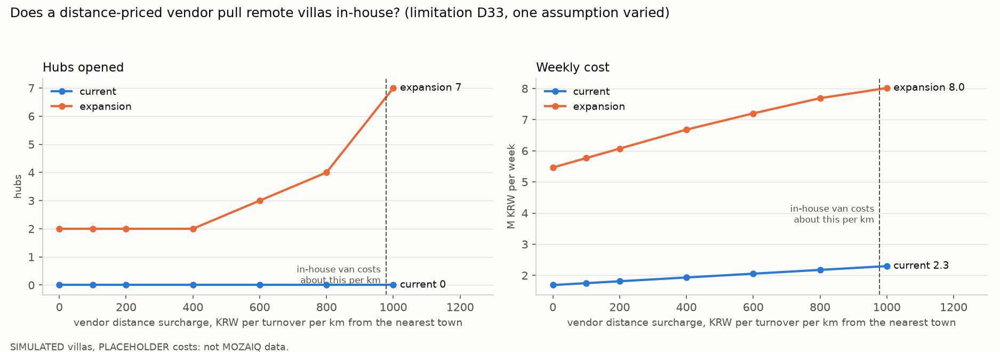

# mozaiq-ops-lab: villa operations hub optimizer (prototype 1 of 3)

> MOZAIQ 별장 운영 허브 최적화 프로토타입입니다. 운영 수치는 실제 MOZAIQ 데이터가 아닌 시뮬레이션 또는 가정치이며, 일부만 공개 자료를 참고했습니다. 제가 2022년 IB 논문에서 설계한 유전 알고리즘을 실제 도로 이동시간(OSRM)을 반영하고 정확해 솔버(PuLP)로 검증할 수 있도록 재구성하여, 세탁·비품 허브를 어디에 둘지(혹은 외주할지) 계산했습니다. 현재 비용 가정에서는 외주가 유리하지만, 여러 별장의 배송을 한 차량에 묶을수록 자체 허브가 유리해집니다. 그 배송 효율을 측정하는 것이 다음 프로토타입(세탁물 라우팅)입니다.

**Everything about MOZAIQ in this repo is simulated or a placeholder.** The only public facts used are: villas in Seoul (Gahoe hanok), Gapyeong, Cheongpyeong, Hongcheon, Yangyang and Jeju; 30+ villas, mostly in the capital area; expansion toward Jeju and Busan and 100+ villas; memberships of 10/20/30 nights a year. Villa counts, turnovers, rents, capacities and costs are assumptions, each marked in [config.yaml](config.yaml) with a source (a page I actually opened, with URL and year) or `PLACEHOLDER`.

## When does building hubs beat outsourcing?



**Key finding.** At costs taken from public references, outsourcing laundry beats building hubs: the exact optimum opens **0 hubs** for today's 30 villas and only **2 hubs** for the 100-villa expansion (5.46M vs 5.58M KRW a week, 2% cheaper than outsourcing everything). The answer turns on two numbers this prototype cannot know from public data: the vendor's fee, and how many villas one van run serves. If each van round trip is shared by about four villa turnovers (0.25 round trips per turnover instead of 1), the first hub already pays off for the 30 villas and the 100-villa network grows to 5 hubs; a vendor fee 1.5x the assumed 15,000 KRW per turnover has a similar effect (1 hub current, 7 expansion). So the build-vs-outsource decision depends on van batching, which prototype 2 (laundry routing) will measure.

## Is the genetic algorithm any good? Checked against an exact solver

The same instances are solved exactly with PuLP/CBC (about 0.1 s each) and compared with the GA over 20 seeds, for two selection rules: **roulette wheel** (the rule in my 2022 paper) and **tournament**. On the two business scenarios the optimum has 0 or 2 hubs, which is easy for any search, so I added three harder *algorithm validation* instances where 5-9 hubs open. **They are not business recommendations**; they only test the algorithm.



| instance | hubs in the exact optimum | roulette: mean / worst gap, optimum found | tournament: mean / worst gap, optimum found |
|---|---|---|---|
| current (business) | 0 | 0.00% / 0.00%, 20 of 20 | 0.00% / 0.00%, 20 of 20 |
| expansion (business) | 2 | 0.19% / 1.92%, 16 of 20 | 0.00% / 0.00%, 20 of 20 |
| validation: vendor fee x2 | 8 | 0.63% / 2.52%, 13 of 20 | 0.00% / 0.00%, 20 of 20 |
| validation: vendor fee x3 | 9 | 1.13% / 3.43%, 5 of 20 | 0.00% / 0.00%, 20 of 20 |
| validation: 0.25 round trips per turnover | 5 | 1.17% / 4.14%, 10 of 20 | 0.00% / 0.00%, 20 of 20 |

Tournament found the exact optimum in **60 of 60** runs on the three validation instances (40 of 40 on the business ones); roulette found it in 28 of 60, falling to 5 of 20 at worst. Roulette's weakness is the one I noted about the 2022 design: fitness = 1 / cost gives nearly equal slices of the wheel when costs are similar, so selection barely favours better solutions. ([convergence curves](outputs/v2_convergence.png))

**Why keep a GA if the exact solver takes 0.1 s?** At this scale (21 candidate hubs, 100 villas, linear costs) the exact solver is the better tool: faster, provably optimal, no tuning. The GA is kept as the bridge from the 2022 paper, and because it only needs a function that scores a hub set, so it can take costs a MIP cannot express directly, for example batched routing from prototype 2. If prototype 2 does not need that, the honest recommendation is the exact solver. See [docs/decisions.md](docs/decisions.md) (D31, D32).

## v1 (2022 paper) vs v2 (MOZAIQ hubs)

| | v1: Walmart Korea, rebuilt as the paper describes | v2: MOZAIQ villa hubs |
|---|---|---|
| Question | Where to put 5 distribution centers for 16 stores | Which of 21 candidate towns get a hub, or outsource to a local vendor |
| Decision | Free latitude/longitude of each DC inside a box (34-38 N, 120-130 E) | Open / closed per candidate town (a bit each) |
| Distance | Straight line (haversine) | Road time and km from OSRM, cached; flagged haversine fallback |
| Cost | Total distance (fitness = 1 / distance) | Weekly van transport + hub rent + vendor fees + capacity and drive-time penalties |
| Constraints | None; a DC can land in the sea | Hub capacity, max linen drive time; **Jeju villas can only use a Jeju hub or the Jeju vendor** (hard) |
| Selection | Roulette wheel | Roulette and tournament, compared on the same seeds |
| Validation | None in the paper; here a k-median heuristic (GA within 1%, heuristic slightly better in both groups; a heuristic check, not a proven optimum) | Exact optimum with PuLP/CBC, 20 seeds, cost gap and runtime |
| Data | 16 Walmart stores (one coordinate in the paper's Appendix 2 was a duplicate and is corrected) | Simulated villas (30 current, 100 expansion), region-level coordinates only |
| Result | Final DC locations, convergence, map: `python -m src.v1_walmart` | Optimum, GA-vs-optimal table, maps, sensitivities |

Full review of the paper (what it got right, 13 limitations and how v2 answers each): [docs/paper_review.md](docs/paper_review.md).

## The problem

MOZAIQ runs a private-villa membership with 30+ standalone villas, mostly in the Seoul capital area, expanding toward Jeju and Busan and 100+ villas. Every checkout is a turnover: cleaning, linen, supplies. Where to base the laundry and supply hubs, or whether to outsource, is a facility-location problem. This started as my 2022 IB extended essay, which used a genetic algorithm to choose distribution-center locations for Walmart Korea: [docs/walmart_paper.md](docs/walmart_paper.md). It had no results, straight-line distance only, no costs beyond distance, and no check against an exact answer. This repo fixes those, then applies the same idea to villas.

## Key results in more detail

**Maps.** Static views below (points only, no basemap; click for full size). The interactive versions, with OpenStreetMap tiles and popups for region, drive time and hub load, are in `outputs/`: [hubs_current.html](outputs/hubs_current.html), [hubs_expansion.html](outputs/hubs_expansion.html), [hubs_expansion_whatif_batched.html](outputs/hubs_expansion_whatif_batched.html). Interactive versions of the maps will be linked via GitHub Pages. Jeju villas are only ever served from Jeju; that is checked on every solution.

<table>
<tr>
<td width="33%"><a href="outputs/hubs_current.png"></a><br><sub><b>Current:</b> 0 hubs, everything outsourced</sub></td>
<td width="33%"><a href="outputs/hubs_expansion.png"></a><br><sub><b>Expansion:</b> 2 hubs (Hongcheon, Jeju City)</sub></td>
<td width="33%"><a href="outputs/hubs_expansion_whatif_batched.png"></a><br><sub><b>What-if, not a recommendation:</b> 0.25 round trips per turnover, 5 hubs</sub></td>
</tr>
</table>





Expansion opens 2 hubs at base rent, 7 at half the rent and none at double; more turnovers per week pull hubs in. (Turnovers x2 or more can exceed hub capacity; capacity is a soft penalty.)



The base model gives the vendor a flat fee regardless of distance, while in-house hubs pay per km. That favours outsourcing remote villas (for example in Gangwon). A vendor surcharge of about what the in-house van costs per km (roughly 1,000 KRW per turnover per km) pulls the 100-villa network to 7 hubs; the 30-villa network still opens none.

## Assumptions and limitations

- **Simulated data.** Villas are simulated at region-level coordinates (about 4 km jitter), never real addresses; counts and weekly turnovers are placeholders ([data/villas.csv](data/villas.csv), [src/make_villas.py](src/make_villas.py)). Jeju villas are in both scenarios (MOZAIQ has Jeju villas); how many, and where on the island, is simulated.
- **Sourced vs placeholder** (see [config.yaml](config.yaml) for URLs and years). Sourced or derived from a page I opened: fuel cost per km, 2026 minimum wage (driver time), capital-area industrial rent (JLL, Q2 2022, four years old), washer throughput, linen kg per hotel room, fallback detour factor and speed (measured from our own OSRM data). **No source found, so placeholders:** the vendor fee per turnover, rents outside the capital area, hub area, machines per hub, linen kg per turnover, max drive time, villa turnovers, GA settings.
- **Van trips are unbatched:** one direct round trip per turnover, an upper bound on van cost. This is probably the most influential number in the model (see the heatmap).
- **Flat vendor fee** (limitation above); the vendor is assumed to exist everywhere.
- **Hub cost is rent only.** Labour, energy and machines are not modelled, which biases toward building hubs, so the "outsource-first" result is not caused by leaving hub costs out.
- **Quality is not modelled.** A luxury brand may keep laundry in-house to control linen quality (consistency, damage and loss, turnaround). The model prices that at zero, so "outsource-first" is a cost-only statement. Prototype 3 (photo-based cleaning QA) could measure vendor-linen defect rates and give that trade-off a number.
- **GA vs exact:** the GA assigns each villa to its cheapest open option and penalizes capacity afterwards; the exact solver is capacity-aware. Capacity never binds in the base results, and each run prints whether it does.
- **Road times** come from the public OSRM demo server (car profile, a September 2026 snapshot in [data/cache/](data/cache/)). Fine for a prototype; a production version would use a self-hosted OSRM or the Kakao Mobility API.
- Every design choice, alternative and reason: [docs/decisions.md](docs/decisions.md) (D1-D40).

## How to run

Python 3.13.

```bash
python3.13 -m venv .venv && source .venv/bin/activate
pip install -r requirements.txt

python -m src.v1_walmart                  # v1: the 2022 GA, prints DC locations, writes outputs/v1_convergence.png and v1_map.html
python -m src.run --scenario current      # v2: exact optimum + GA-vs-optimal table
python -m src.run --scenario expansion
python -m src.run --stress                # algorithm-validation instances (not business results)
python -m src.make_outputs                # regenerates every chart, map and table in outputs/ (about a minute)
pytest                                    # 30 tests, none use the network
```

Runs are offline: road times come from the committed cache. If you delete it, the first run fetches the pairs from OSRM at 1 request per second (about a minute) and falls back to straight-line x 1.27 for any pair that fails, flagging it in the output. Same seeds give the same results (map HTML files differ in random element ids only).

## How prototypes 2 and 3 will reuse this

- [src/travel.py](src/travel.py): the road-time matrix with per-pair cache, batching, rate limit and flagged fallback. Prototype 2 (laundry pickup/delivery routing) needs villa-to-villa and hub-to-villa times; they go into the same cache.
- [src/data.py](src/data.py) and [data/villas.csv](data/villas.csv): one villa list with stable ids for all three prototypes; [src/geo.py](src/geo.py) and [config.yaml](config.yaml) conventions (every assumption sourced or marked).
- Prototype 2 turns the biggest placeholder here, van round trips per turnover, into a measurement. Its batched route cost is exactly the non-linear kind of cost a GA can score and a MIP cannot state directly.
- Prototype 3 (photo-based cleaning QA) attaches to the same villa ids, and its defect data can put a number on the in-house-vs-vendor quality question.

## Built with Claude Code

I framed the problem, made the modeling decisions, designed the validation, and reviewed every phase; the code was written with Claude Code.

## Attribution

Road data © OpenStreetMap contributors (ODbL), served by OSRM ([data/cache/NOTICE.md](data/cache/NOTICE.md)). Map tiles © OpenStreetMap contributors.

---

I'd love to run this on real turnover and cost data.
